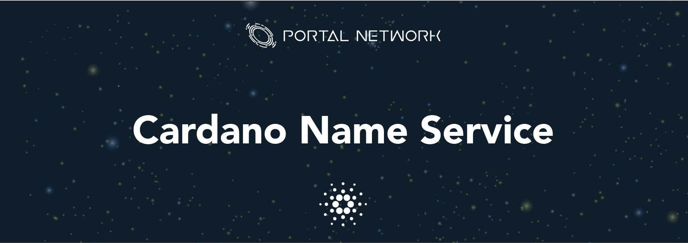

> 📖🔍 Documents of the Cardano Name Service.

## 💡 What is BNS?
BNS – or blockchain name system – is the protocol on the internet that turns human-comprehensible decentralized website names such as 'website.ada' or 'mywebsite.ada' into addresses understandable by decentralized network machines.

## 📝 Description

CNS is the Cardano Name Service, a distributed, open, and extensible naming system based on the Ethereum blockchain.

## 📚 Documents

#### Table of Contents
-  [Introduction](./docs/INTRODUCTION.md)
- [Using Mallet To Deploy Contract](/depoly_md/Cardano%20install%20Mallet%20to%20deploy%20and%20interact%20with%20smart%20contract.md)
- [Cardano Develop Environment Study](./docs/CardanoDevelopEnvironmentStudy.md)

## 📣 Contributing
See [CONTRIBUTING.md](./CONTRIBUTING.md) for how to help out.

## 🗒 Licence
See [LICENSE](./LICENSE) for details.
